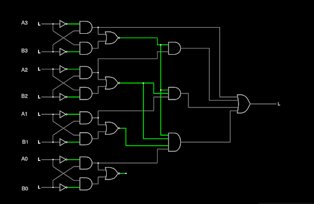
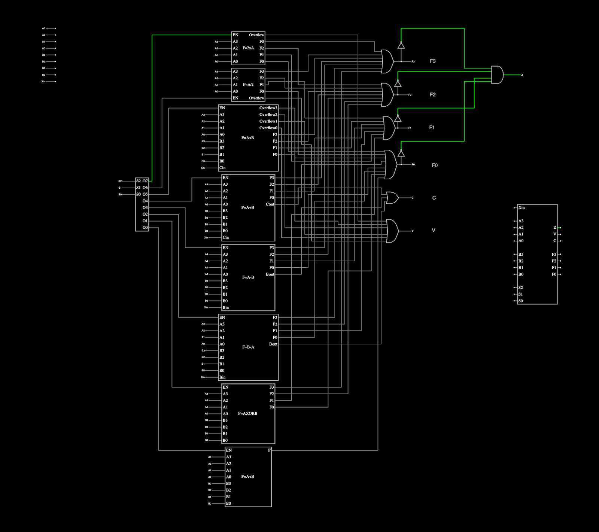

<div class="text-center p-4">
  
  
</div>

An arithmetic logic unit (ALU) is a fundamental digital circuit used in processors to perform arithmetic and logic operations. For this project, the task was to design and implement a 4-bit ALU from the ground up, integrating multiple functions such as addition, subtraction, multiplication, division, shifting, XOR, and comparison. The project emphasized both hardware design and digital logic concepts, requiring simulation and testing to ensure that the ALU performed each operation correctly. In addition to the hardware design, we were also required to write Verilog code that mirrored the circuit, implementing the same operations programmatically.

To complete the project, I started by creating and testing each building block, including full adders, full subtractors, multipliers, dividers, and logic gates, many of which I implemented using truth tables and ROM-based logic. I then combined these blocks into a single ALU using enable pins, a decoder for operation selection, shared output lines, and overflow, carry, and zero detection logic. After validating the full design in simulation, I implemented the ALU in Verilog, writing a clean, modular hardware description and a comprehensive testbench to exhaustively verify each operation. This process gave me hands-on experience in circuit design, schematic integration, Verilog coding, simulation workflows, and systematic debugging, closely mirroring real-world hardware design practices.

Here is part of design code to define operations that illustrates the verilog part of the project:
```verilog
4'b0000: begin // F = 2 x A with a flag for overflow
    F = A << 1;
    Z = (F == 0);
    V = (A[3:0] != 0); // Overflow occurs if lower 4 bits of A are not all zeros after left shift
    C = 0;
end

4'b0001: begin // F = A / 2 with a flag for overflow
    F = A >> 1;
    Z = (F == 0);
    V = A % 2; // Overflow/Remainder for division by 2
    C = 0;
end
```

Here is part of testbench stimulus code that illustrates the verilog part of the project:

```verilog
initial begin
    // Test case 1: 2 x A with a flag for overflow
    A = 4'b1111;
    display_inputs_for_AxB(A);
    opcode = 4'b0000; // Left shift
    cin = 0;
    #10;
    display_flags(F, Z, V, C);
  
    // Test case 2: A / 2 with a flag for overflow
    A = 4'b0111;
    display_inputs_for_AxB(A);
    opcode = 4'b0001; // Right shift
    cin = 0;
    #10;
    display_flags(F, Z, V, C);
```

If you are interested in the course, you can learn more at [ECE 260 - Introduction to Digital Design](https://catalog.manoa.hawaii.edu/preview_course_nopop.php?catoid=2&coid=36706).
