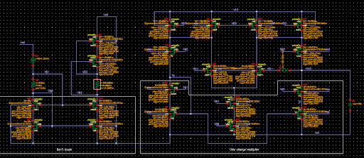

Cadence Virtuoso is a widely used software suite in both academia and industry for analog and mixed-signal circuit design. During the summer, I was mentored in designing a Folded Cascode Operational Transconductance Amplifier (OTA), a topology known for its high gain and wide output swing, making it well-suited for high-precision analog applications.

As part of the project, I began by creating a schematic based on an original design provided to me. The main task involved determining appropriate transistor sizes to achieve specific performance targets: a voltage gain greater than 80 dB and a bandwidth exceeding 2 MHz.

After finalizing the schematic, I created a corresponding symbol for easier integration into larger designs. The final step involved developing the layout, ensuring proper matching, routing, and adherence to design rules. The completed layout successfully passed both Design Rule Check (DRC) and Layout Versus Schematic (LVS) verification, confirming that it met all design specifications and was consistent with the schematic.
